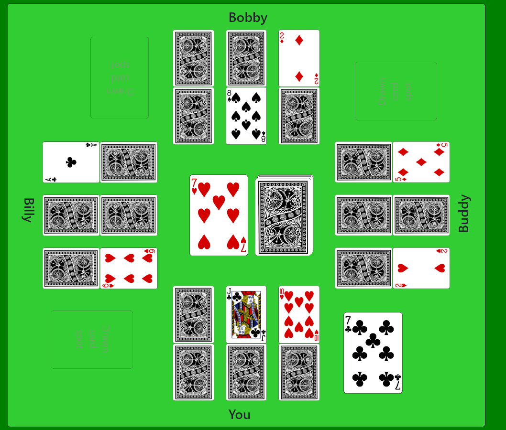

<!-- PROJECT INTRO -->
<div align="center">
  <h1>Golf</h1>
  <p>A front end app for a card game, using Typescript and jQuery</p>
  <a href="https://jade-treacle-89190e.netlify.app">Try me out!</a>
</div>
</br>


### Built With

[![Typescript][Typescript-lang]][Typescript-url]
[![Bootstrap][Bootstrap.com]][Bootstrap-url]
[![JQuery][JQuery.com]][JQuery-url]

<!-- GETTING STARTED -->
### Getting Started

1. Clone the repo
   ```sh
   git clone https://github.com/kirra-hyde/golf-card-game
   ```
2. Install dependencies
    ```sh
    npm install
    ```
3. To run or test the program:
    ```sh
    npm run <!-- Insert from table -->
    ```
| Command     | Description          |
|-------------|----------------------|
| start       | Start                |
| start:debug | Start w/debugger     |
| test        | Run tests            |
| test:cov    | Run tests w/coverage |
| test:debug  | Run tests w/debugger |

<!-- USAGE -->
## Usage

This is a card game, played against 3 computer players. Take a card into your hand from the deck or discard pile, or flip a card. The object of the game is to get as few points as possible. Kings are worth 0 points, Queens and Jacks are worth 10 points, and the other cards are worth their numbers (e.g. 2s are worth 2 points). Be careful about flipping both cards in a column. Once you do, that column is locked, and you're stuck with those points. But try to get cards of the same rank in the same column. If you do, they'll cancel each other out, and you'll get 0 points for the column! After a player flips all their cards, the other players get one more turn, then the round ends. The game ends when a player gets 100 points, at which point, whoever has the lowest score wins.

<!-- ACKNOWLEDGMENTS -->
## Acknowledgments

I used the wonderful Deck of Card API by Chase Roberts to track the state of a deck of cards and handling drawing from the deck and shuffling. (See https://deckofcardsapi.com/.)


<!-- MARKDOWN LINKS & IMAGES -->
[Typescript-lang]: https://img.shields.io/badge/TypeScript-007ACC?style=for-the-badge&logo=typescript&logoColor=white
[Typescript-url]: https://www.typescriptlang.org/
[Bootstrap.com]: https://img.shields.io/badge/Bootstrap-563D7C?style=for-the-badge&logo=bootstrap&logoColor=white
[Bootstrap-url]: https://getbootstrap.com
[JQuery.com]: https://img.shields.io/badge/jQuery-0769AD?style=for-the-badge&logo=jquery&logoColor=white
[JQuery-url]: https://jquery.com